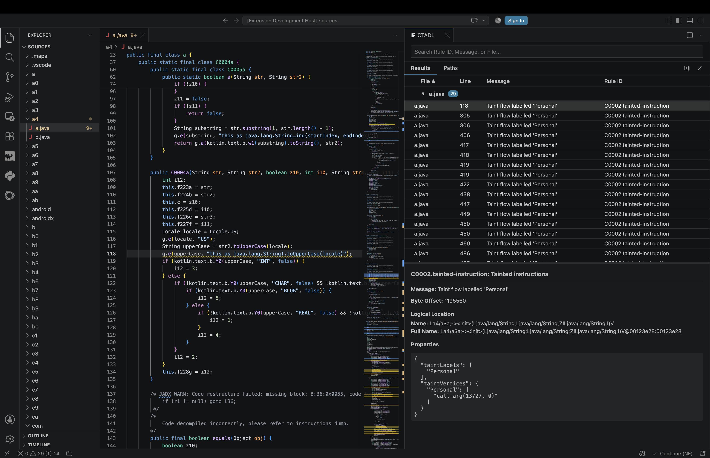

# Tutorial

This tutorial shows how to load CTADL SARIF results in VS Code, review findings, and trace paths when CTADL path data is available.

## Setup

1. Install the extension as described in the [README](README.md#usage).
2. Open the source root in VS Code with **File > Open Folder**. For Ascent-based SARIF, open the folder that contains the matching `.maps` directory so binary locations can be remapped to source.
3. Load your SARIF file by running **CTADL: Open SARIF File**, or run **CTADL: Toggle Panel** and click **Open SARIF File**.

If you already have a CTADL `*.sarif` file, no additional CTADL setup is required for basic result viewing.

### Optional: Generate SARIF

To generate SARIF with CTADL's one-shot `go` command, include `--name`. The same project name is used later for path tracing.

```bash TUTORIAL.md
ctadl go \
  --name my-project \
  --sarif-profile machine \
  --output results.sarif \
  --models /path/to/query.json \
  /path/to/artifact.apk
```

### Optional: Prepare Path Tracing

**Get Paths for Current Line** requires an indexed CTADL project and a local `get-paths` executable. From a local `ctadl-rs` checkout, build the CTADL binaries:

```bash TUTORIAL.md
cargo build --release -p ctadl-ascent --bins
```

This produces `ctadl` and `get-paths` in Cargo's release output directory, usually `target/release/` under the checkout. Set **CTADL: Ascent Path** to the absolute path of that directory.

Next, import and index the artifact using the same project name stored in the SARIF `properties.project_name` value:

```bash TUTORIAL.md
/path/to/ctadl import /path/to/artifact.apk --name my-project
/path/to/ctadl index my-project
```

To generate SARIF from that indexed project, run:

```bash TUTORIAL.md
/path/to/ctadl query my-project \
  --sarif-profile machine \
  --output /path/to/results.sarif \
  --models /path/to/query.json
```

## Review Results

Open the CTADL Results Panel with **CTADL: Toggle Panel**. The panel has two tabs: **Results** and **Paths**.

The **Results** tab lists findings by file. Expand a file group, then select a row to jump to the mapped source location and show details in the lower pane. Findings without mapped source information appear under **No Location**.

Use the search box to filter results by rule ID, message, or file. The search filter applies to the **Results** tab only.

Mapped findings also appear as editor squiggles and in **View > Problems** when `ctadl.showDiagnostics` is enabled.



## Trace Paths

The **Paths** tab is empty until you request paths for a source line. With a SARIF file loaded, right-click a line in the editor and select **Get Paths for Current Line**. You can also run the command from the command palette.

The extension searches all taint vertices associated with the current line and shows any matching paths in the **Paths** tab:

- **Forward Paths (Target → Sink)** show flows from the selected target to sinks.
- **Backward Paths (Source → Target)** show flows from sources to the selected target.

Expand a path group to review its steps. Select a step to jump to its source location and show step details in the lower pane. A line value of `—` means no source line could be mapped for that step.

## Settings and Shortcuts

Open **File > Preferences > Settings** and search for `CTADL` to configure the extension. Common settings include:

- `ctadl.showDiagnostics`: show findings as squiggles and Problems entries.
- `ctadl.ascentPath`: directory containing `get-paths`.
- `ctadl.collapsePathDuplicates`: collapse consecutive path steps on the same file and line.
- `ctadl.hideBlankLineResults`: hide path steps with no mapped line number.

Open **File > Preferences > Keyboard Shortcuts** and search for `CTADL` to assign shortcuts. CTADL commands are also available from the command palette.
